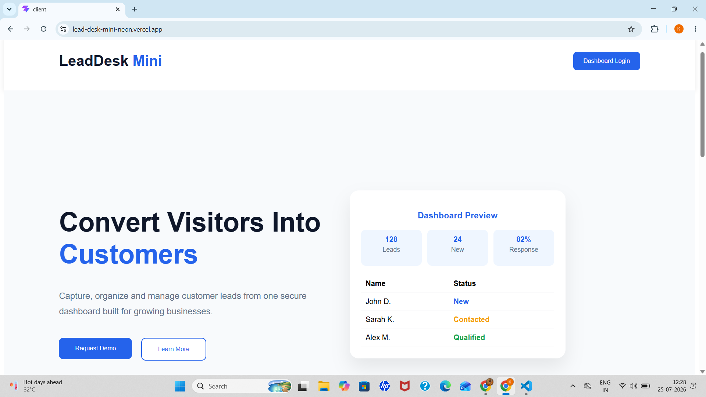
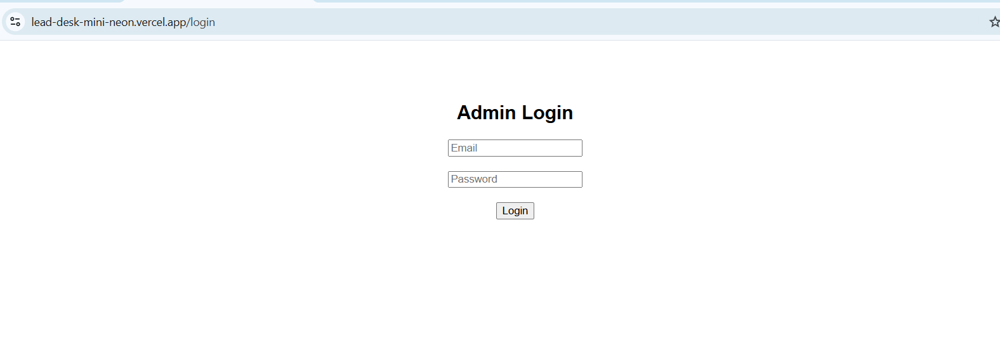
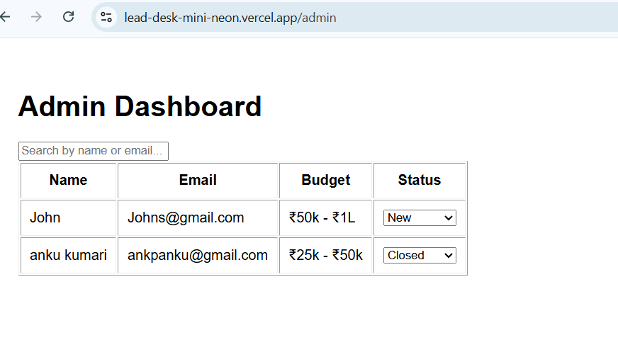

# 🚀 LeadDesk Mini

LeadDesk Mini is a full-stack lead management application developed as part of the **Digital Heroes Full Stack Internship Assignment**. It allows businesses to collect customer leads through a responsive landing page and manage them securely from an admin dashboard.

---

## ✨ Features

- Responsive landing page
- Lead capture form
- Secure JWT-based admin authentication
- Admin dashboard to manage leads
- Search leads by name or email
- Update lead status (New, Contacted, Qualified)
- MongoDB Atlas database integration
- RESTful API using Express.js
- Fully deployed frontend and backend

---

## 🛠️ Tech Stack

### Frontend
- React.js
- Vite
- React Router DOM
- CSS

### Backend
- Node.js
- Express.js
- MongoDB Atlas
- Mongoose
- JWT Authentication
- bcryptjs

### Deployment
- Frontend: Vercel
- Backend: Render
- Database: MongoDB Atlas

---

## 📁 Project Structure

```
LeadDesk-Mini/
│
├── client/
│   ├── public/
│   ├── src/
│   └── package.json
│
├── server/
│   ├── config/
│   ├── models/
│   ├── routes/
│   ├── middleware/
│   ├── server.js
│   └── package.json
│
└── README.md
```

---

## 🚀 Live Demo

-**Frontend:**https://lead-desk-mini-neon.vercel.app/

-**Backend:**https://leaddesk-mini-8d0s.onrender.com/

---

## 🔐 Admin Features

- Secure Login
- View Submitted Leads
- Search Leads
- Update Lead Status
- Protected Dashboard Access

---

## 📸 Screenshots

### Landing Page

### Login Page

### Admin Dashboard


---

## ⚙️ Installation

### Clone the Repository

```bash
git clone https://github.com/katherin915/LeadDesk-Mini.git
```

### Install Frontend

```bash
cd client
npm install
npm run dev
```

### Install Backend

```bash
cd server
npm install
npm start
```

---

## 🔑 Environment Variables

Create a `.env` file inside the **server** folder.

```env
MONGO_URI=<your_mongodb_connection_string>
JWT_SECRET=<your_secret_key>
```

---

## 📌 API Endpoints

### Authentication

| Method | Endpoint |
|--------|----------|
| POST | /api/auth/register |
| POST | /api/auth/login |

### Leads

| Method | Endpoint |
|--------|----------|
| POST | /api/leads |
| GET | /api/leads |
| PUT | /api/leads/:id |

---

## 🌟 Future Improvements

- Dashboard analytics
- Email notifications
- Lead export (CSV)
- Pagination
- Role-based authentication
- Dark mode

---

## 👩‍💻 Author

**Katherin Pandey**

GitHub: https://github.com/katherin915

---

## 📄 License

This project was developed as part of the **Digital Heroes Full Stack Internship Assignment**.